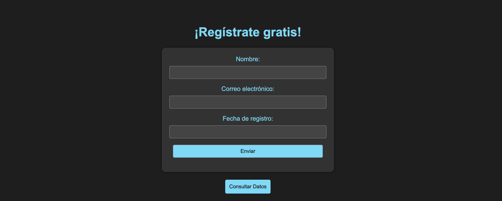
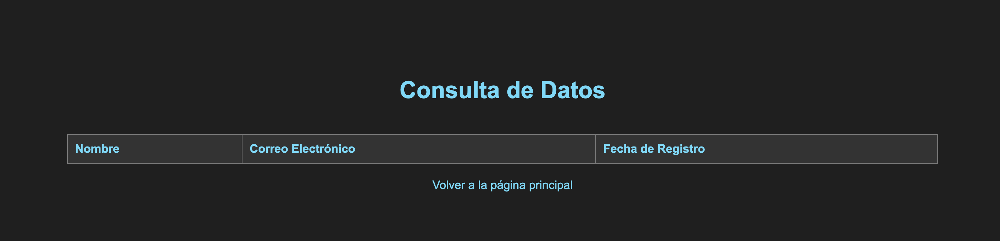

# Descripción de Archivos Relacionados a Nuestra Cloud Run

En esta carpeta, encontramos varios archivos cruciales para nuestra aplicación en Cloud Run:

1. **Dockerfile:** Este archivo es fundamental ya que se encarga de construir una imagen basada en Python. Copia el app.py, la carpeta templates y el archivo requirements.txt. Luego, instala los requisitos y ejecuta el app.py.

2. **app.py:** Este archivo es nuestra aplicación en sí. Interactúa con los servicios de Google Cloud para el almacenamiento y procesamiento de datos. Se complementa con un index.html ubicado en la carpeta "templates". Este archivo proporcionan una interfaz atractiva para nuestra aplicación, dándole ese toque especial.

